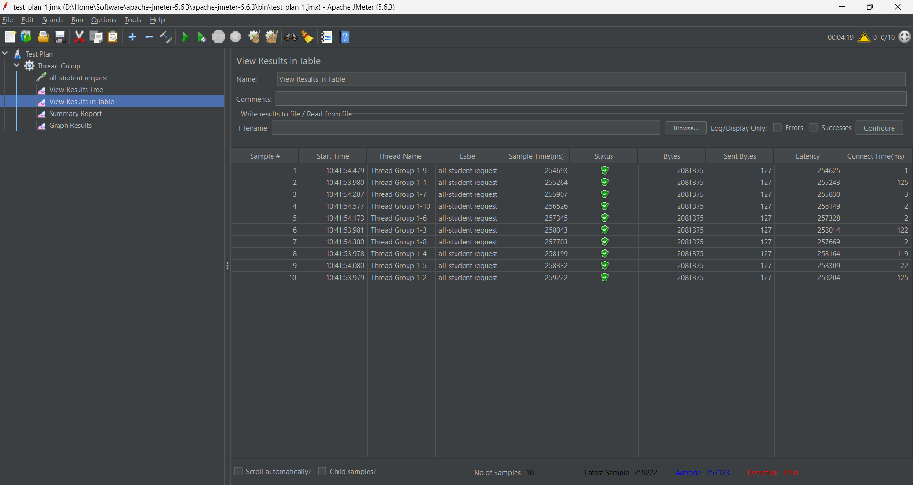
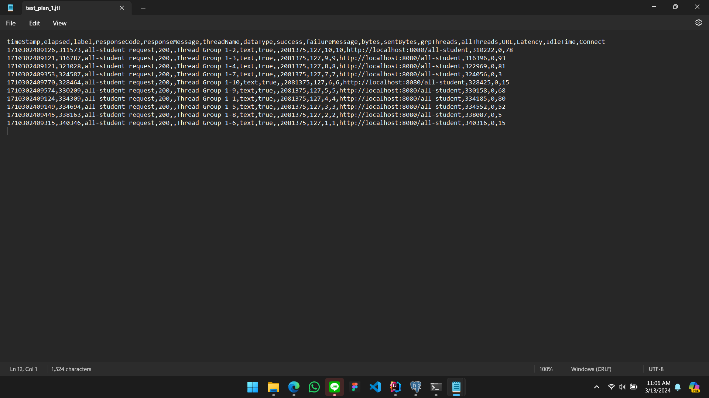
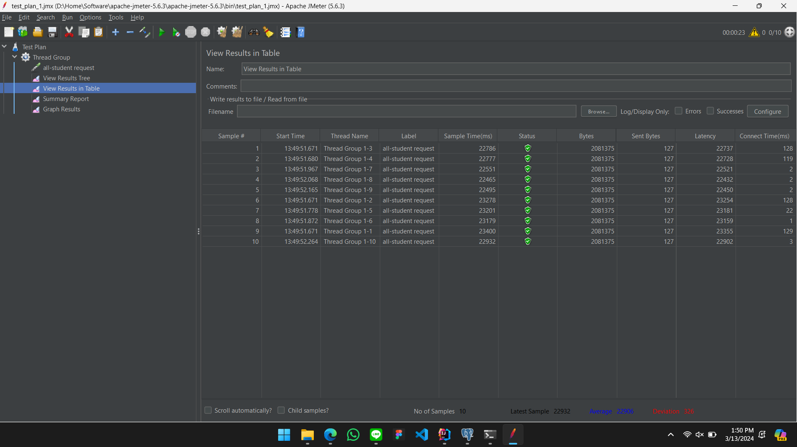
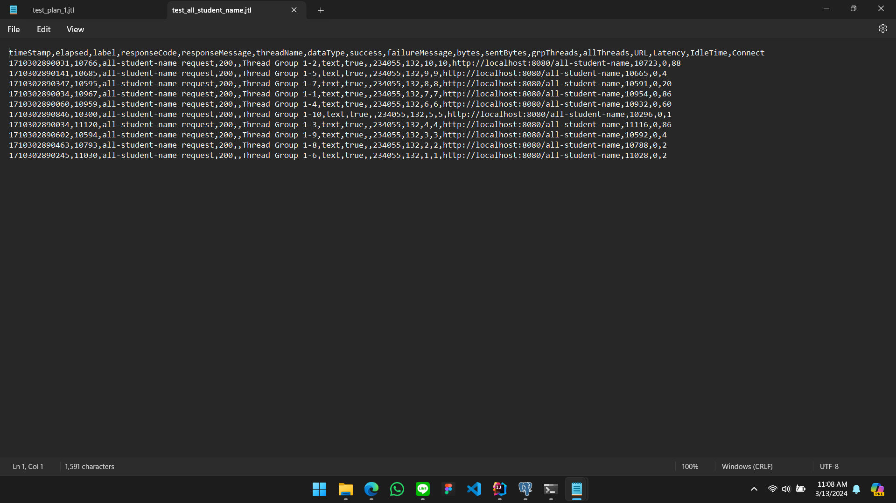
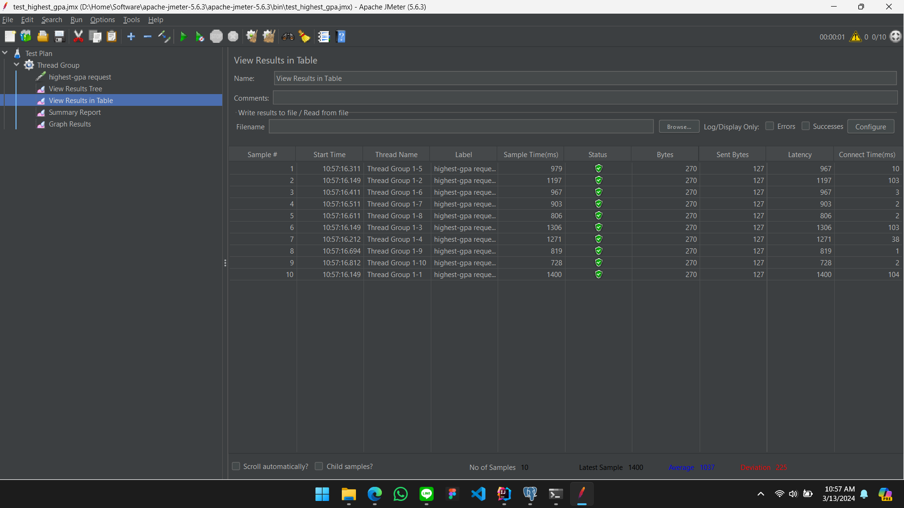
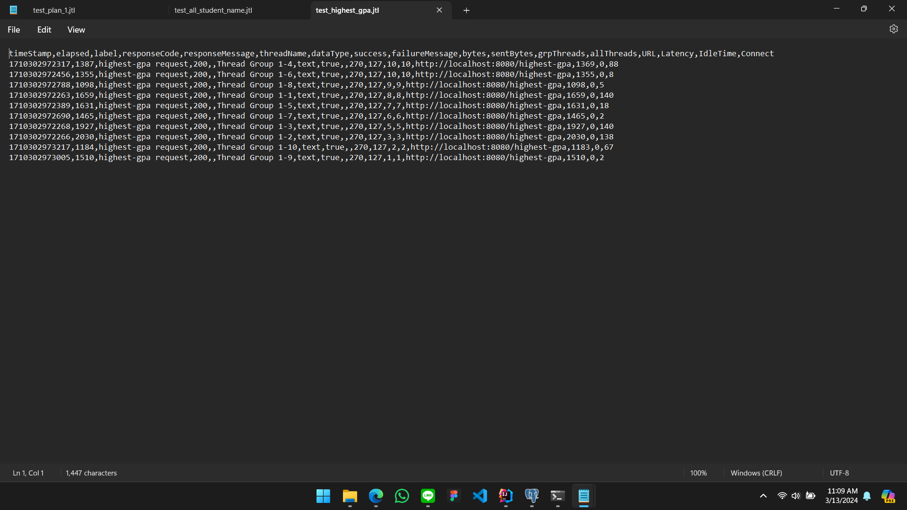
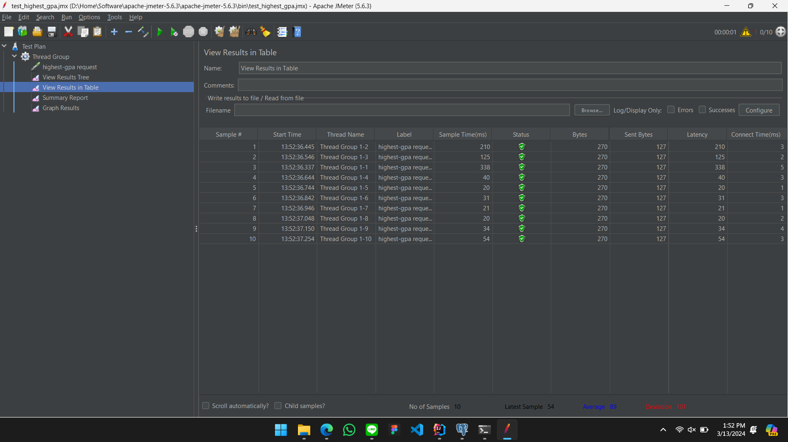

Tegar Wahyu Khisbulloh - 2206082032 - Pemrograman Lanjut A

Module 5 - Java Profiling
---
## Reflection
### Apa perbedaan antara pendekatan Performance Testing dengan JMeter dan profiling dengan IntelliJ Profiler dalam konteks mengoptimalkan kinerja aplikasi?
1. Pendekatan JMeter untuk Performance Testing:
   - JMeter digunakan untuk mensimulasikan beban pengguna yang tinggi pada aplikasi.
   - Memberikan gambaran tentang bagaimana aplikasi akan berperilaku dalam situasi traffic yang tinggi.
   - JMeter mengukur metrik kinerja seperti waktu respons, throughput, dan kecepatan transaksi.
2. Profiling dengan IntelliJ Profiler:
   - Profiling dengan IntelliJ Profiler lebih fokus pada pemetaan bagaimana kode aplikasi bekerja.
   - Memungkinkan untuk melacak waktu yang dihabiskan dalam setiap metode atau fungsi.
   - Profiler membantu mengidentifikasi di mana waktu CPU dihabiskan, lokasi alokasi memori yang tinggi, dan titik-titik lain di mana optimasi dapat dilakukan.

### Bagaimana proses profiling membantu Anda dalam mengidentifikasi dan memahami titik-titik lemah dalam aplikasi Anda?

Proses profiling sangat membantu dalam mengidentifikasi dan memahami titik lemah dalam aplikasi 
dengan menganalisis bagian-bagian kode yang menjadi bottleneck dalam aplikasi. Profiling memberikan
informasi tentang waktu eksekusi, alokasi memori, dan penggunaan CPU dari setiap metode atau fungsi
yang dieksekusi selama aplikasi berjalan. Dengan informasi ini, kita dapat mengetahui bagian mana yang
perlu untuk dioptimalkan.

### Apakah menurut Anda IntelliJ Profiler efektif dalam membantu Anda menganalisis dan mengidentifikasi bottleneck dalam kode aplikasi Anda?
Menurut saya, IntelliJ Profiler sudah cukup efektif dalam membantu menganalisis dan mengidentifikasi
bottleneck dalam kode aplikasi. IntelliJ Profiler memberikan informasi yang cukup lengkap dengan visualisasi
seperi flame graph yang memudahkan kita dalam menganalisis kode aplikasi. 

### Apa saja tantangan utama yang Anda hadapi saat melakukan performance testing dan profiling, dan bagaimana Anda mengatasi tantangan tersebut?
Tantangan utama yang saya hadapi saat melakukan performance testing dan profiling adalah dalam membaca 
dan menganalisis hasil profiling dan performance testing karena interpretasi hasil profiling dan performance
sangat lengkap dan kompleks. Untuk mengatasi tantangan ini, saya mencoba untuk memahami hasil profiling dan
performance testing dengan membaca dokumentasi dan mencari referensi lainnya.

Selain itu, optimasi kode juga merupakan tantangan tersendiri. Setelah menemukan titik lemah dalam aplikasi,
saya harus memastikan bahwa perubahan yang saya lakukan tidak mempengaruhi fungsionalitas aplikasi dan 
memiliki performa yang lebih baik.

### Apa manfaat utama yang Anda peroleh dari menggunakan IntelliJ Profiler untuk melakukan profiling kode aplikasi Anda?
Manfaat utama yang saya peroleh dari menggunakan IntelliJ Profiler untuk melakukan profiling  
adalah visualisasi yang jelas tentang alokasi waktu CPU dan penggunaan memori dalam program. Dengan alat 
ini, saya dapat dengan cepat mengidentifikasi dan mengisolasi area-area yang memakan waktu atau memori 
secara berlebihan, memungkinkan saya untuk melakukan optimasi yang lebih efektif.

### Bagaimana Anda menangani situasi di mana hasil dari profiling dengan IntelliJ Profiler tidak sepenuhnya konsisten dengan temuan dari performance testing menggunakan JMeter?
Apabila saya menemukan hasil yang tidak konsisten, saya
akan mencoba untuk menganalisis lebih lanjut dan memriksa apakah ada perbedaan dalam kondisi pengujian atau
konfigurasi yang dapat mempengaruhi hasil pengujian.

### Strategi apa yang Anda implementasikan dalam mengoptimalkan kode aplikasi setelah menganalisis hasil dari performance testing dan profiling? Bagaimana Anda memastikan perubahan yang Anda buat tidak mempengaruhi fungsionalitas aplikasi?
- Pada method `getAllStudentsWithCourses()` saya mengubah implementasi awal menjadi `studentCourseRepository.findAll()` karena
pada dasarnya method `findAll()` sudah mengambil semua data yang dibutuhkan tanpa perlu melakukan query tambahan.
- Pada method `joinStudentNames()` saya mengubah penggunaan String biasa menjadi StringBuilder untuk 
menggabungkan nama-nama siswa. Dengan menggunakan StringBuilder, operasi penggabungan string dilakukan 
secara lebih efisien karena StringBuilder memungkinkan manipulasi string tanpa menciptakan objek string 
baru setiap kali iterasi. Hal ini mengurangi overhead yang terkait dengan manipulasi string dan meningkatkan kinerja kode secara keseluruhan.
- Pada method `findStudentWithHighestGpa()` saya menambahkan query `SELECT * FROM students ORDER BY gpa DESC LIMIT 1` 
untuk selalu mengurutkan data berdasarkan nilai gpa dan mengambil data pertama saja.

## JMeter Results

### `/all-student` endpoint
Before Optimization

After Optimization

### `all-student-name` endpoint
Before Optimization

After Optimization

### `highest-gpa` endpoint
Before Optimization

After Optimization
